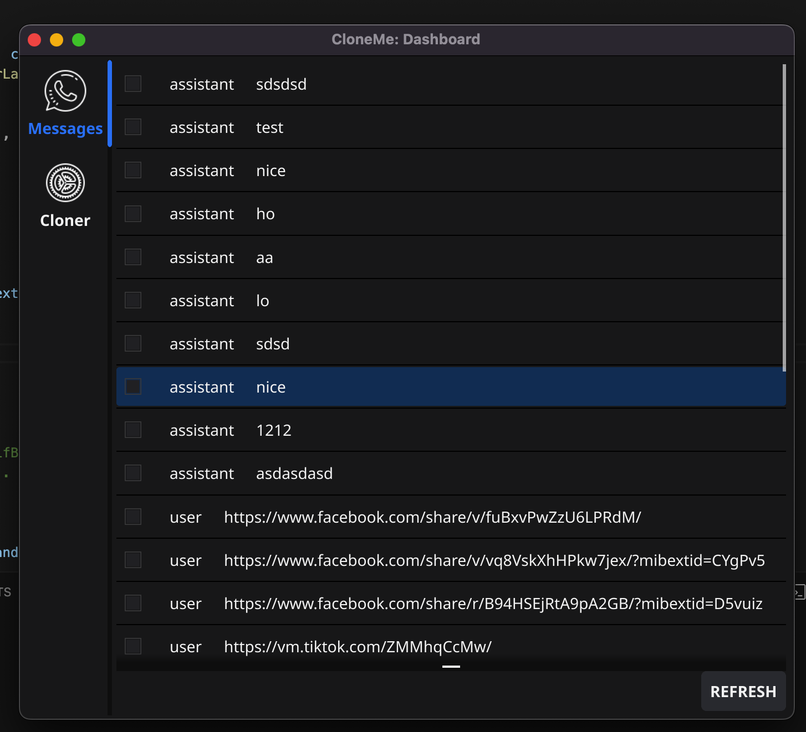
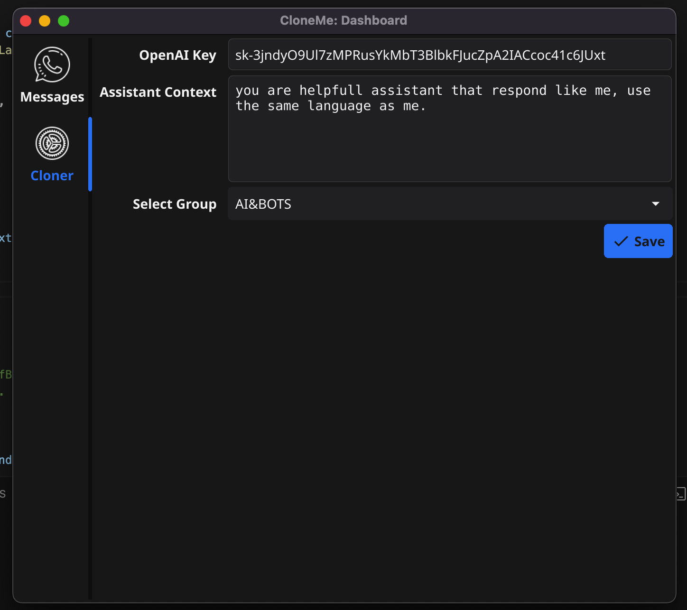

  

<h1 align="center">🤖 My WhatsApp Assistant</h1>

  Application that takes WhatsApp messages to create a good assistant that can mimic your daily conversation and automatically respond to your contacts.

## 🚀 Features

- **Conversation Mimicking**: Mimics your conversation style and tone to provide natural-sounding responses.
- **Automatic Response**: Automatically responds to incoming messages from your contacts based on context and conversation history.
- **Customizable Responses**: Allows you to customize and train the assistant with predefined responses or personalized messages.
- **Learning Capabilities**: Learns from user interactions and feedback to improve response accuracy and relevance over time.
- **Privacy Protection**: Ensures user privacy by securely handling personal data and conversations.
- **Multi-platform Support**: Supports multiple platforms and devices, allowing you to access the assistant from anywhere.
  - **Interactive UI**: Provides a user-friendly interface for managing conversations, settings, and preferences.
- **Integration with Other Apps**: Integrates seamlessly with other applications and services for enhanced functionality.

## 📷 Screenshots

  
  

## 🛠️ Installation

Describe how to install and set up your WhatsApp Assistant. Include any prerequisites and installation steps.

## 🎮 Usage

Provide instructions on how to use your WhatsApp Assistant. Include examples and screenshots if necessary.

## 🤝 Contributing

Contributions are welcome! Please follow the [contributing guidelines](CONTRIBUTING.md) to contribute to this project.

## 📝 License

This project is licensed under the [MIT License](LICENSE).

## 📝 Trello

This project planning under the [board](https://trello.com/invite/b/je8LhpRu/ATTI964ea30475400410bc263ecdcbd296827D90A8F8/alx-team).

## 📧 Contact

If you have any questions or feedback, feel free to contact us at [contact@dup.company](mailto:contact@dup.company).

## 🌟 Acknowledgements

- Acknowledgement 1: Thank someone or mention resources that helped you in your project.
- Acknowledgement 2: Thank another person or organization for their support or inspiration.

---

  <a href="#-features">Features</a> •
  <a href="#-screenshots">Screenshots</a> •
  <a href="#️-installation">Installation</a> •
  <a href="#-usage">Usage</a> •
  <a href="#-contributing">Contributing</a> •
  <a href="#-license">License</a> •
  <a href="#-contact">Contact</a> •
  <a href="#-acknowledgements">Acknowledgements</a>
  <a href="#-trello">Trello</a>

